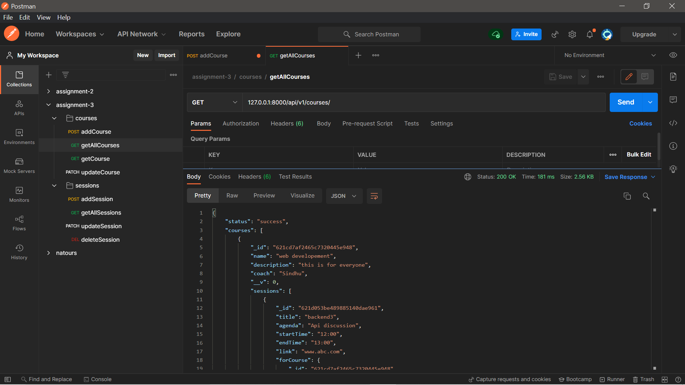
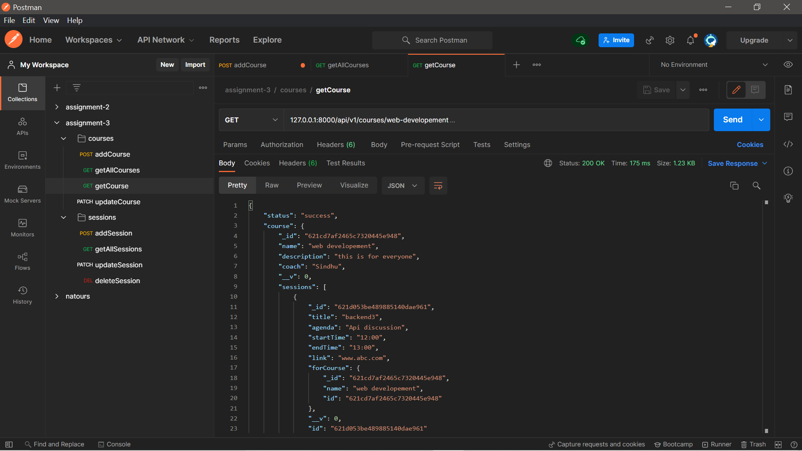
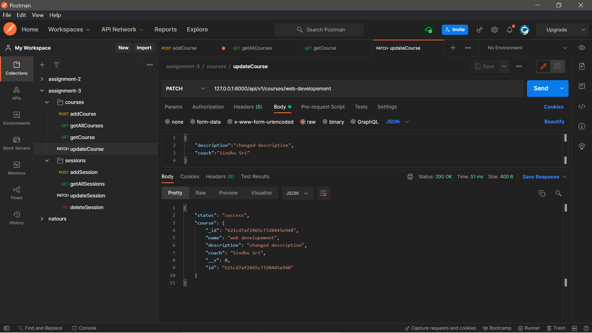
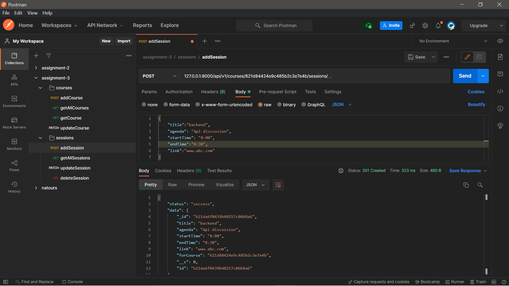
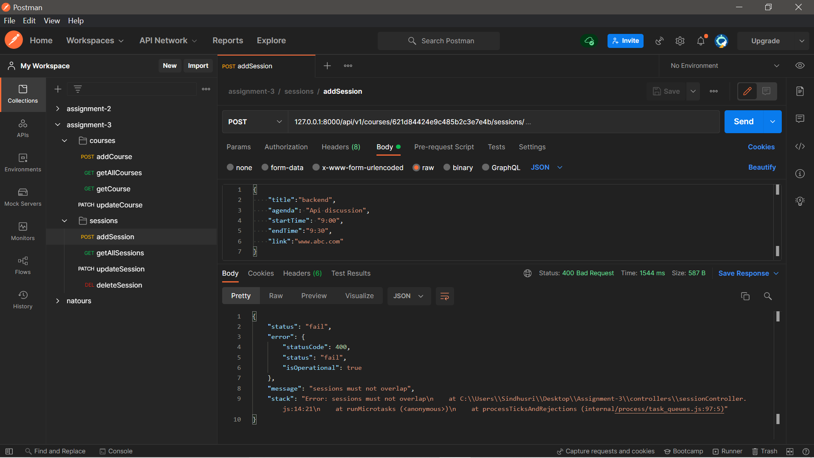
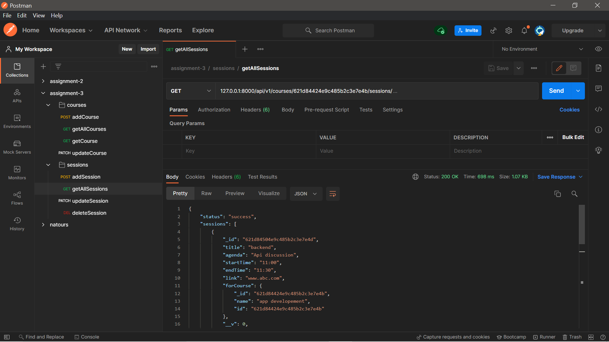
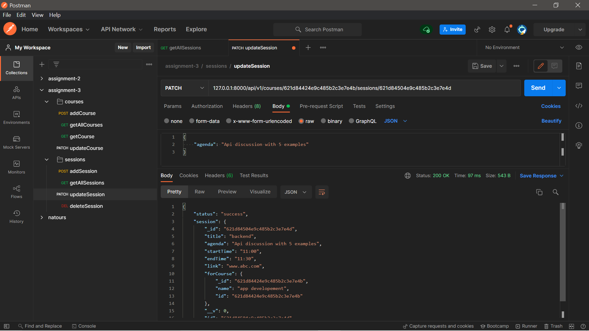
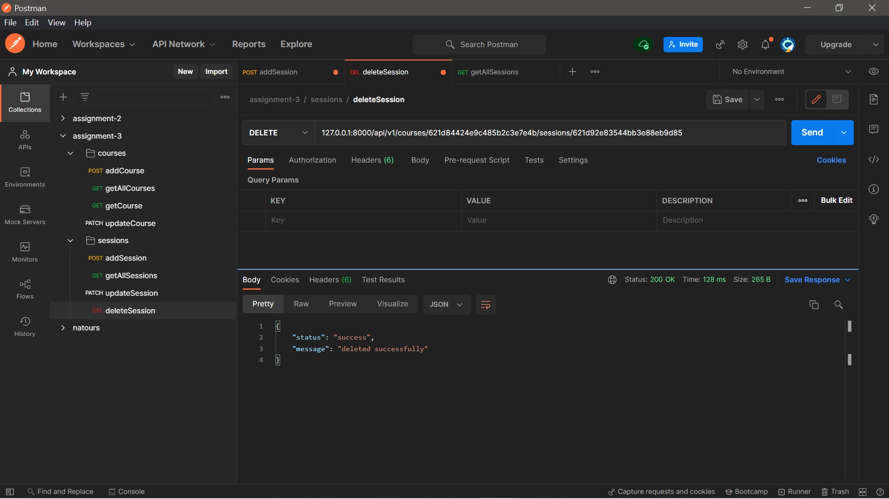
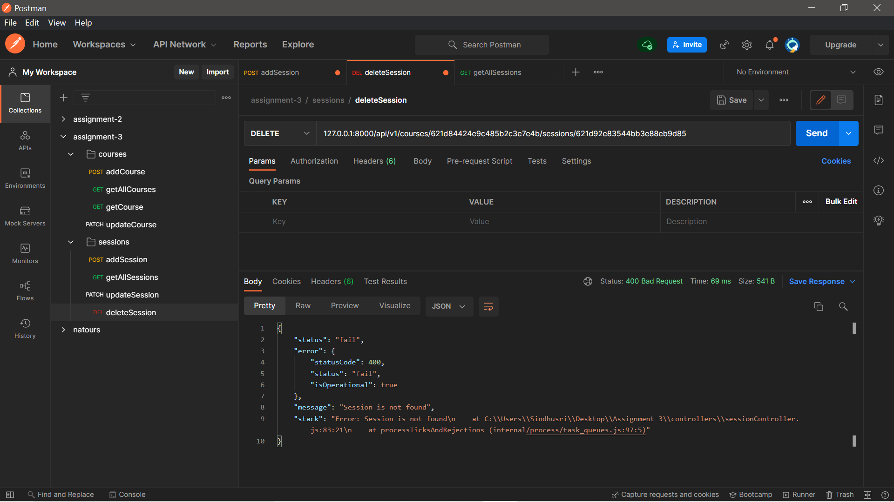

# Course - session

This is a restfull api made using node.js,express.js,mongodb.
API is tested in postman(which is super easy to use).

Before explaining functionality of api, here's how one can run this project on their local computer

- Download repository by clicking code button on the repository git page or pull the repo on to your local computer
- To run this project use commands : 

     ```
     npm install
     npm start
     ```
- `npm start` for running application in development environment.
- To run this project in production environment use `npm run start:prod`.
- Connect your own mongodb database to check. I have used environment variables to connect to mongodb. create config.env file and add these environment variables:

    ```
    NODE_ENV=development
    PORT=8000
    DATABASE=mongodb+srv://USERNAME:<PASSWORD>@cluster0.ehevc.mongodb.net/DBNAME?retryWrites=true&w=majority
    DATABASE_PASSWORD=PASSWORD GIVEN WHILE CREATING DB

    JWT_SECRET=create-your-own-secret-token-for-authentication
    JWT_EXPIRES_IN=90d
    ```
This api has following functionalities.
1. Add a course
2. Update a course
3. Delete a course
4. Get all course
5. Add a session to course
6. Update session
7. Delete session
8. Get all sessions of a course

## Course - 

### Add course

**Query**
    *POST* /api/v1/courses/

**Response _(for-success)_**

    statusCode : 200

    ```
    {
        "status": "success",
        "data": {
        "_id": "621da2cd439b48257c06b898",
        "name": "app developement 2",
        "description": "this is for everyone",
        "coach": "Sindhu",
        "__v": 0,
        "id": "621da2cd439b48257c06b898"
        }
    }
    ```

- tested against data

    ```
    {
        "name":"app developement 2",
        "description":"this is for everyone",
        "coach":"Sindhu"
    }
    ```

Here's screenshot of adding course successfully 


**Response _(for-errors)_**

- If course name already exists in db then error occurs


### Get all courses

**Query**
    *GET* /api/v1/courses/

**Response _(for-success)_**

    ```
    {
    "status": "success",
    "courses": [
        {
            "_id": "621cd7af2465c7320445e948",
            "name": "web developement",
            "description": "this is for everyone",
            "coach": "Sindhu",
            "__v": 0,
            "sessions": [
                {
                    "_id": "621d053be489885140dae961",
                    "title": "backend3",
                    "agenda": "Api discussion",
                    "startTime": "12:00",
                    "endTime": "13:00",
                    "link": "www.abc.com",
                    "forCourse": {
                        "_id": "621cd7af2465c7320445e948",
                        "name": "web developement",
                        "id": "621cd7af2465c7320445e948"
                    },
                    "__v": 0,
                    "id": "621d053be489885140dae961"
                }
            ]
        }
    ]
    }
    ```
Here's screenshot of quering all courses 



### Get a course by name

**Query**
    *GET* /api/v1/courses/web-developement/

**Response _(for-success)_**

    ```
    {
    "status": "success",
    "course":
        {
            "_id": "621cd7af2465c7320445e948",
            "name": "web developement",
            "description": "this is for everyone",
            "coach": "Sindhu",
            "__v": 0,
            "sessions": [
                {
                    "_id": "621d053be489885140dae961",
                    "title": "backend3",
                    "agenda": "Api discussion",
                    "startTime": "12:00",
                    "endTime": "13:00",
                    "link": "www.abc.com",
                    "forCourse": {
                        "_id": "621cd7af2465c7320445e948",
                        "name": "web developement",
                        "id": "621cd7af2465c7320445e948"
                    },
                    "__v": 0,
                    "id": "621d053be489885140dae961"
                }
        }
    ]
    }
    ```
Here's screenshot of quering all courses 



### Update a course

**Query**
    *PATCH* /api/v1/courses/web-developement/

**Response _(for-success)_**

    ```
    {
    "status": "success",
    "course": {
        "_id": "621cd7af2465c7320445e948",
        "name": "web developement",
        "description": "changed description",
        "coach": "Sindhu Sri",
        "__v": 0,
        "id": "621cd7af2465c7320445e948"
    }
    }
    ```
Here's screenshot of successfull update of a course 



## Session -

**Query**
    *POST* /api/v1/courses/{courseId}/sessions/

**Response _(for-success)_**



**Response _(for-errors)_**

- If sessions overlap




**Query**
    *GET* /api/v1/courses/{courseId}/sessions/

**Response _(for-success)_**




**Query**
    *PATCH* /api/v1/courses/{courseId}/sessions/{sessionId}

**Response _(for-success)_**




**Query**
    *DELETE* /api/v1/courses/{courseId}/sessions/{sessionId}

**Response _(for-success)_**



**Response _(for-errors)_**

- If no session is found




## packages

- Following are the packages I used

    - express => This a node framework which allows rapid development and provides features like easy routing.

    - morgan => Got to know about this when I ran into a bug, Where I was unable to access req.body . Using this package developer gets access to request's body.

    - dotenv => This is used to inform files about presence of environment variables.

    - mongoose => This is a ODM library for Mongodb. It provides features like modelling data, simple query API, middlewares etc.

    - nodemon => It is a dev-dependecy, used so that developer dont need to start server everytime developer change something.

## Resources I used

- Mongodb documentation.
- Express documentation.
- mongoose documentation.
- Github pages of packages that I used.
- Referred stackoverflow if i wasn't able to figure out an error.
- For error handling I followed methods which I learnt in a MERN stack bootcamp.